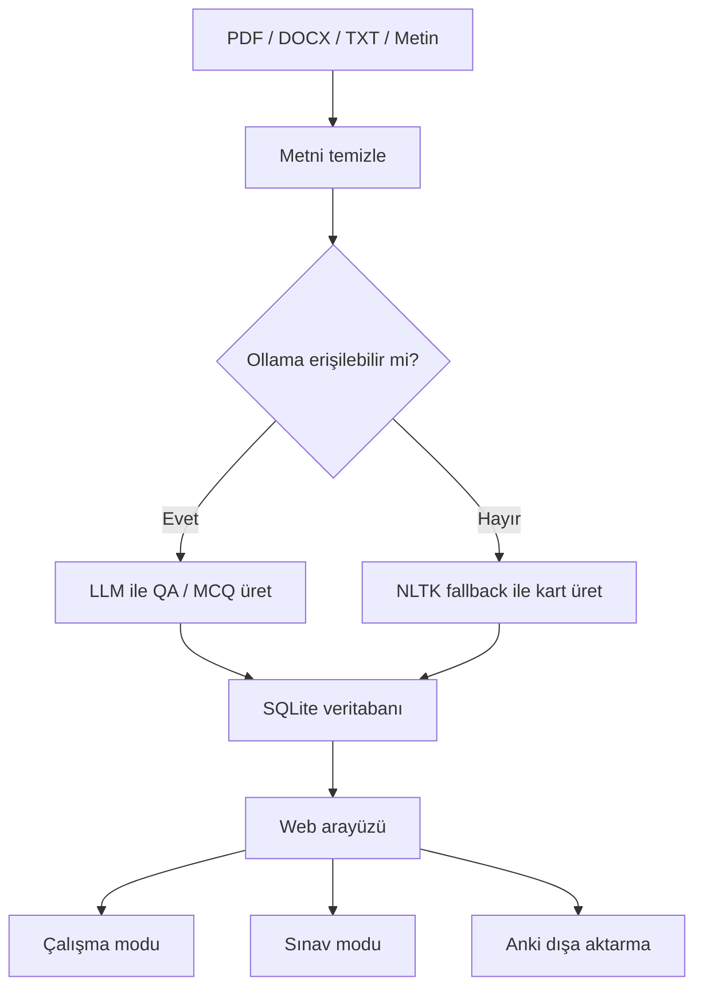

# Smart Flashcard

Akıllı Flashcard; PDF, DOCX, TXT veya doğrudan yazılan metinlerden otomatik çalışma kartları ve sınavlar üreten yerel bir eğitim asistanıdır. FastAPI tabanlı backend, sade bir web arayüzü, SQLite veritabanı ve Ollama destekli yerel LLM üretimiyle çalışır.

Uygulama internet zorunluluğu olmadan çalışacak şekilde tasarlanmıştır. Ollama ve varsayılan model hazırsa kartlar LLM ile üretilir; Ollama kullanılamıyorsa sistem NLTK tabanlı üretim akışına düşer.

## Özellikler

- PDF, DOCX ve TXT dosyalarından metin çıkarma
- Manuel metin girişiyle hızlı kart üretimi
- QA ve çoktan seçmeli kart desteği
- Ollama üzerinden yerel LLM üretimi
- Ollama kapalıyken NLP tabanlı fallback üretim
- Kart listeleme, düzenleme, silme ve filtreleme
- Çalışma modu ve doğru/yanlış tekrar kaydı
- Sınav modu, otomatik puanlama ve harf notu
- Türkçe karakterleri dikkate alan esnek cevap kontrolü
- Etiket yönetimi
- Anki için sekmeyle ayrılmış dışa aktarma
- Açık/koyu tema ve tarayıcı TTS desteği

## Teknoloji Yığını

- Backend: FastAPI, Uvicorn
- Frontend: HTML, CSS, Vanilla JavaScript
- Veritabanı: SQLite, SQLAlchemy
- LLM: Ollama, varsayılan model `qwen2.5:7b`
- NLP ve doküman işleme: NLTK, PyMuPDF, python-docx

## Kurulum

### 1. Python ve bağımlılıklar

Python 3.10 veya üzeri önerilir.

Windows için hızlı kurulum:

```bat
kurulum.bat
```

Elle kurulum:

```bash
python -m venv .venv
.venv\Scripts\activate
python -m pip install --upgrade pip
pip install -r requirements.txt
```

### 2. Ollama modeli

LLM ile üretim yapmak için Ollama kurulu ve çalışıyor olmalıdır.

```bash
ollama pull qwen2.5:7b
```

Ollama kullanmak istemiyorsanız uygulama yine çalışır; kart üretimi NLP fallback ile yapılır.

## Başlatma

Windows üzerinde tek tıkla başlatmak için:

```bat
BASLAT.bat
```

Elle başlatmak için:

```bash
.venv\Scripts\activate
cd backend
uvicorn main:app --reload --port 8000
```

Arayüz:

```text
http://localhost:8000
```

API dokümantasyonu:

```text
http://localhost:8000/docs
```

Sağlık kontrolü:

```text
http://localhost:8000/health
```

## Kullanım Akışı

1. Ana ekranda PDF, DOCX veya TXT dosyası yükleyin ya da metninizi doğrudan yazın.
2. Başlık ve kart sayısını seçin.
3. QA ve isterseniz MCQ üretimini açın.
4. `Flashcard Üret` butonuyla kartları oluşturun.
5. `Kartlarım` sekmesinde kartları filtreleyin, düzenleyin veya Anki için dışa aktarın.
6. `Çalış` sekmesinde kartları tekrar edin.
7. `Sınav` sekmesinde kartlardan test oluşturup sonucunu görün.

## Üretim Mantığı

Kart üretiminde önce Ollama bağlantısı kontrol edilir.



LLM durumu şu endpoint ile kontrol edilebilir:

```text
GET /api/llm/status
```

## Başlıca API Endpointleri

| Endpoint | Açıklama |
| --- | --- |
| `POST /api/upload` | PDF, DOCX veya TXT dosyası yükler |
| `POST /api/text` | Manuel metin kaydeder |
| `GET /api/documents` | Dokümanları listeler |
| `GET /api/documents/{id}` | Doküman detayını ve kartlarını getirir |
| `DELETE /api/documents/{id}` | Dokümanı ve kartlarını siler |
| `POST /api/generate` | Doküman için flashcard üretir |
| `GET /api/flashcards` | Kartları filtrelerle listeler |
| `PUT /api/flashcards/{id}` | Kartı günceller |
| `DELETE /api/flashcards/{id}` | Kartı siler |
| `POST /api/flashcards/{id}/review` | Tekrar sonucunu kaydeder |
| `POST /api/quiz/generate` | Kartlardan sınav oluşturur |
| `POST /api/quiz/submit` | Sınav cevaplarını değerlendirir |
| `GET /api/tags` | Etiketleri listeler |
| `POST /api/tags` | Etiket oluşturur |
| `GET /api/export/anki/{document_id}` | Kartları Anki uyumlu TXT olarak indirir |

## Proje Yapısı

```text
smart-flashcard/
├── backend/
│   ├── data_processing/       # PDF, DOCX ve metin temizleme
│   ├── flashcard_generator/   # NLP tabanlı QA üretimi
│   ├── llm/                   # Ollama istemcisi ve prompt akışı
│   ├── question_generator/    # MCQ ve zorluk sınıflandırma
│   ├── routers/               # API endpointleri
│   ├── tasks/                 # Otomatik temizlik görevi
│   ├── config.py              # Uygulama ayarları
│   ├── database.py            # SQLite bağlantısı
│   ├── main.py                # FastAPI giriş noktası
│   ├── models.py              # SQLAlchemy modelleri
│   └── schemas.py             # Pydantic şemaları
├── frontend/
│   ├── css/style.css
│   ├── js/
│   │   ├── api.js
│   │   ├── app.js
│   │   ├── quiz.js
│   │   ├── theme.js
│   │   └── tts.js
│   ├── index.html
│   └── logo.png
├── uploads/                   # Yüklenen dosyalar
├── requirements.txt
├── kurulum.bat
├── BASLAT.bat
└── LICENSE
```

## Ayarlar

Varsayılan ayarlar `backend/config.py` içindedir. `.env` dosyasıyla aynı alanları ezebilirsiniz.

Öne çıkan ayarlar:

- `DATABASE_URL`: SQLite veritabanı konumu
- `UPLOAD_DIR`: yüklenen dosya klasörü
- `MAX_FILE_SIZE_MB`: maksimum dosya boyutu
- `ALLOWED_EXTENSIONS`: desteklenen dosya türleri
- `MAX_CARDS_PER_DOCUMENT`: doküman başına üst kart sınırı
- `AUTO_CLEANUP_ENABLED`: otomatik temizlik görevini açar/kapatır
- `AUTO_CLEANUP_HOURS`: temizlik aralığı

Ollama modelini değiştirmek için `backend/llm/ollama_client.py` içindeki `DEFAULT_MODEL` değerini güncelleyin.

## Anki Dışa Aktarma

`Kartlarım` sekmesindeki Anki butonu veya aşağıdaki endpoint, kartları Anki'nin içe aktarabileceği sekmeyle ayrılmış TXT formatında üretir:

```text
GET /api/export/anki/{document_id}
```

Çıktı formatı:

```text
Soru<TAB>Cevap<TAB>Etiketler
```

## Lisans

Bu proje MIT lisansı ile yayımlanmıştır. Ayrıntılar için `LICENSE` dosyasına bakın.
