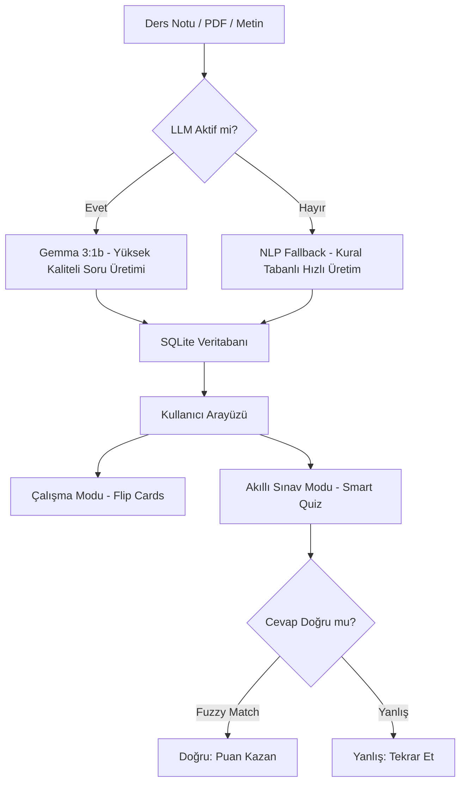

# 📚 Smart Flashcard — Akıllı Bilgi Kartı Üretim ve Sınav Sistemi

**Smart Flashcard**, ders notlarınızdan, PDF dokümanlarınızdan veya metin kırıntılarınızdan otomatik olarak profesyonel bilgi kartları (flashcard) üreten, yapay zeka destekli bir eğitim asistanıdır. Yerel bir LLM (Gemma 3) kullanarak verilerinizi gizli tutar ve internete ihtiyaç duymaz.

---

## 🚀 Proje Genel Bakış

Bu proje, öğrencilerin ve eğitimcilerin çalışma materyallerini saniyeler içinde etkileşimli testlere dönüştürmesini sağlar. Geleneksel yöntemlerden farkı, üretilen soruların kalitesi ve sınav modundaki "akıllı değerlendirme" mantığıdır.

### 🎥 İş Akışı (Flowchart)



---

## ✨ Temel Özellikler

-   **🤖 Yapay Zeka Destekli Üretim**: `gemma3:1b` modeli ile kavramsal, derinlikli ve akıl yürütücü sorular üretilir.
-   **📈 Akıllı Sınav Modu**: Yazdığınız cevaplardaki küçük yazım hatalarını veya Türkçe eklerini (örn: "Veritabanıdır" vs "Veritabanı") anlayan **Bulanık Eşleşme (Fuzzy Match)** algoritması.
-   **🔊 Sesli Seslendirme (TTS)**: Kartlardaki soruları ve cevapları sesli olarak dinleme özelliği.
-   **📦 Anki Dışa Aktarma**: Üretilen kartları popüler Anki uygulamasına `.apkg` formatında aktarma desteği.
-   **🌓 Dinamik Temalar**: Göz yormayan Gece Modu ve klasik Aydınlık Mod desteği.
-   **📄 Geniş Dosya Desteği**: PDF, DOCX ve TXT dosyalarını doğrudan işleme kabiliyeti.

---

## 🛠️ Teknoloji Yığını

-   **Backend**: [FastAPI](https://fastapi.tiangolo.com/) (Yüksek performanslı Python Web Framework)
-   **Frontend**: Vanilla Javascript (ES6+), Modern CSS3 (Glassmorphism), Semantic HTML5
-   **Veritabanı**: SQLite (SQLAlchemy ORM ile)
-   **Yapay Zeka (LLM)**: [Ollama](https://ollama.com/) üzerinden **Gemma 3:1b**
-   **NLP**: NLTK (Doğal Dil İşleme)

---

## ⚙️ Kurulum ve Başlatma

### 1. Ön Hazırlık (Ollama)
Uygulamanın zeki sorular üretmesi için Ollama gereklidir:
1. [Ollama.com](https://ollama.com/) adresinden indirin ve kurun.
2. Terminale şu komutu yazarak modeli indirin:
   ```bash
   ollama pull gemma3:1b
   ```

### 2. Uygulamayı Çalıştırma
Proje klasöründeki sihirli dosyayı kullanın:
- **`BASLAT.bat`** dosyasına çift tıklayın. 
  - *Bu dosya otomatik olarak sanal ortamı kuracak, bağımlılıkları yükleyecek ve tarayıcıyı açacaktır.*

---

## 🧠 Sınav Değerlendirme Mantığı

Sistem, sınav modunda verdiğiniz cevapları sadece "metin karşılaştırması" yaparak değerlendirmez:
- **Kök Filtresi**: Kelimelerin eklerini (suffix) temizleyerek ana anlama odaklanır.
- **Harf Toleransı**: "İ/i" ve "I/ı" gibi Türkçe karakter karmaşasını çözer.
- **Benzerlik Skoru**: Eğer cevabınız doğru cevaba %50'den fazla harf dizilimi olarak benziyorsa, sistem bunu "Doğru" kabul eder. Bu sayede öğrenme süreciniz teknik hatalarla bölünmez.

---

## 📁 Proje Klasör Yapısı

```text
smart-flashcard/
├── backend/            # API, Veritabanı Modelleri ve LLM Mantığı
│   ├── llm/            # Prompt mimarisi ve Ollama bağlantısı
│   ├── routers/        # Sınav, Export ve Flashcard endpointleri
│   └── database.py     # SQLite bağlantı ayarları
├── frontend/           # Modern UI dosyaları (HTML, CSS, JS)
├── requirements.txt    # Python bağımlılık listesi
├── BASLAT.bat          # Tek tıkla çalıştırma scripti
└── LICENSE             # MIT Lisansı
```

---

## 📜 Lisans

Bu proje **MIT Lisansı** altında korunmaktadır. Eğitim amaçlı veya ticari projelerinizde özgürce kullanabilir, geliştirebilir ve dağıtabilirsiniz.

---

> **Geliştirici Notu:** Bu uygulama, öğrenmeyi daha zevkli ve verimli hale getirmek için modern web teknolojileri ve yerel yapay zeka modellerinin gücünü birleştirir.
